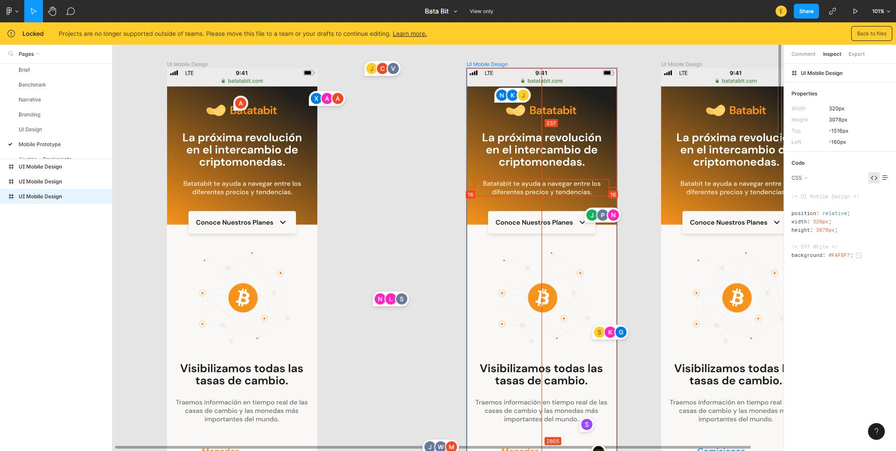

# Practicing Responsive Design: Mobile First

This project was the result of the course [Responsive Design: Layout Mobile First](https://platzi.com/cursos/mobile-first/) that I took in Platzi.

## Design

The design isn't mine, its a Figma project proportioned in the course mentioned above. [Link To The Figma Project](https://www.figma.com/file/sMmlQaZldfDcLERYYWe6h4/Bata-Bit?node-id=44%3A594&t=YRG6kxOH69FqqWaN-0).

If you want to read the code, consider that the comments are in Spanish because that's my native language.

## [Deployed Project](https://ea-gadgeter.github.io/mobile-first-batatabit/)
